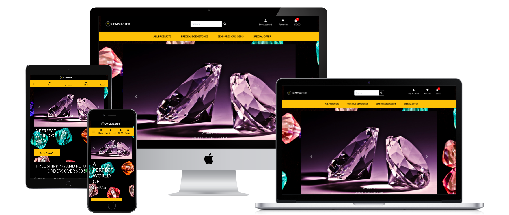
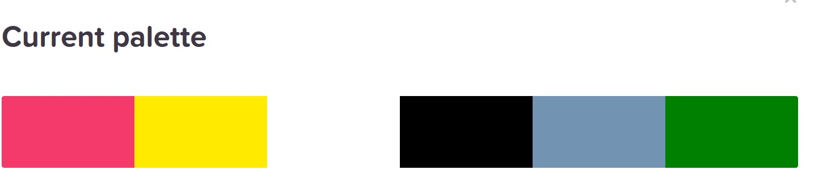
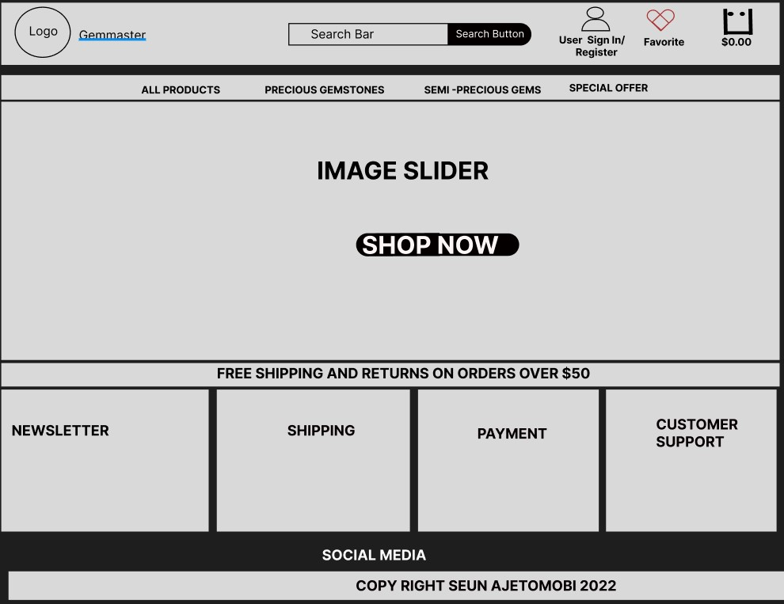

# GEMMASTER

## **Introduction**

Gemmaster is an E-commerce web application that ticks every single boxes of a fully functional  E-commerce application criteria. The application was developed based on the fundamentals of a digital business strategy with the help of technology to achieve business goals and to build strong business relationships between consumers and service providers and business relationship i.e E-commerce website relations could be (B2B -Business to Business and B2C -   Business to Consumer).

### **About the application**

Gemmaster is specialized in various gemstone sales to direct consumers so it is  categorized a B2C web application in the sense that it only services is based on a business to customer relationship, it is a fully E-commerce web application  that deals in varieties of gemstones accross the globe, from Diamonds, Emeralds, Sapphires to name a few to Gemstone lovers who are keen about the originality and detailed history of what their customized jewellry is made of.The E-commerce application is user friendly and with a functional responsive interface across all devices.



**NB: Please Note**: The data on the website is for educational purposes only.

[Here is the link to the live version](https://gem-master.herokuapp.com/)


## Table of Contents

- [**Introduction**](#introduction)
  - [**About the application**](#about-the-application)
- [**UX (User Experience)**](#ux-user-experience)
  - [**User Stories**](#user-stories)
- [**Design Choices**](#design-choices)
  - [**Typography**](#Typography)
  - [**Colour Scheme**](#colour-scheme)
  - [**Wireframes**](#wireframes)
- [**Features**](#features)
  - [**Site Navigation**](#site-navigation)
  - [**Future Features**](#feature-features)
  - [**Error Page**](#error-page)
  - [**Responsive Design**](#responsive-design)
  - [**Defensive Design**](#defensive-design)
- [**Database Schema**](#database-schema)
- [**Technologies**](#technologies)
  - [**Languages**](#languages)
  - [**Frameworks**](#frameworks)
  - [**Libraries**](#libraries)
  - [**Tools**](#tools)
- [**Manual Testing**](#manual-testing)
- [**Bugs**](#bugs)
  - [**Bugs fixed**](#bugs-fixed)
  - [**Known Bugs**](#known-bugs)
- [**Deployment**](#deployment)
  - [**Running Locally**](#forking-the-gitHub-repository)
- [**Web Marketing & Business**](#web-marketing-&-business)
- [**Credits**](#credits)
  - [**Media**](#media)
  - [**Acknowledgements**](#acknowledgements)


## **User Stories**

#### **Views and Navigation**
*****************************

- As a user I can be able to view a list of products so that I can choose what to buy.

- As a user I can be able to view each product details so that I can See the price, item description, item images, item rating and sizes.

- As a user I can be able to see deals and special offers so that I can have the chance to save on items I of my interest to buy.

- As a user I can be able to view my purchase total with ease at any given time so that I do not overspend.

- As a user I can be able to like products so that I can view them later in my wishlist.

- As a user I can be able to navigate around the website with ease.

- The Website homepage is equiped with different functionlity which allows a user to navigate around the website right from the homepage , the presence of the shop now button on the carousel gives a direct access into the list of products available for sale. 

#### **Registrations and User Accounts**

- As a/an Site User I can be able to register an account with ease so that I can have an account that allows me to have a private profile.

- As a Site User I can be able to signin and signout easily so that I can **my personal account informations and update my profile.

- As a Site User I can be able to **recover my forgotten password with ease so that I can gain access to my account.

- As a Site User I can be able to receive a confirmation email after registration so that I can be rest assured my registration was successful.

- As a Site User I can be able to customize my user profile so that I can view my order history,confirmation and able to securely save my payment information and addresses on my profile.


#### **Searching and Filtering**

- As a  user I can search for products through the help of the search bar located at top of the navigation system. To view product information, users only click on the product and every detailed information about the product will be displayed for readablitiy. A Users can search for  products by name or by keyword using the search functionality provided at the top of the page. The product display page can be further narrowed down by searching products by category, Price, Alphabetically or by product rating.

- As a user I can be able to filter through available products so that I can identify best rated, best priced and filter products categorically.

- As a user I can be able to filter through products categorically so that I can **find the best priced, highly rated product in a specific category or filter products in that category by name.

- As a user I can be able to filter numerous categories of products simultaneously so that I can find the best priced or highly rated product across broad categories, such as "apparel" or "homeware".

- As a user I can be able to search for item by name or description so that I can locate the item I want to buy.

- As a user I can be able to view my searh results and what I have searched for so that I can easily see if the search product is available.

#### **Purchase and Checkout**

- As a user I can be able to **choose the size and quantity of a product when making a order so that I can carefully select item size or quantity without mistake.

- As a user I can be able to view the content of my shopping cart so that I can keep track of the total cost of my order and what to receive.

- As a user I can be able to modify the contents of my shopping cart so that I can make changes before final checkout.

- As a user I can be able to enter my payment information with ease so that I can checkout easily without delay.

- As a user I can be able to have a sense of security that my personal data is well protected and secure so that I can feel at ease to enter my information without feeling insecure.

- As a user I can be able to **view an order confirmation after checkout so that I can be sure that no mistake was made on my order.

- As a user I can be able to get an email confirmation of my order after checkout so that I can keep track my order record and purchases.

#### **Payment**.

- As a user I can be able to complete my order with a friendly payment system.

#### **Security**.

- As a user I can be rest assured that I can feel secure  when putting my informations on the website.

#### **Admin and Store Management**.

- As a/an Store Owner** I can be able to Add, Edit/Update and Delete products/items so that I can Add new Items, Change/Edit product prices, modify product descriptions, edit images, Remove/Delete items/Products that are out of stock.
#### **Newsletter**.

- As a user I can subscribe to the website news letter so that I can have a first hand information and updates on products, deals, news and special offers.
#### **Customer support**.

- As a user I can As a User I want to have access to customer support, So that I can contact the support team for assistance on different scenarios that can occur.


## **UX (User Experience)**

[Back to contents](#table-of-contents)


## **Design Choices**

### **Typography**

- The website has a user friendly navigation system with colors and contrast well thought to give the user a friendly color ,font and contrast experience.

- The website logo was personally designed to suite the website purposes.

### **Colour Scheme**


The colors used in this project are:
- (#FFFFFF) - White
- (#000000) - Black
- (#FFEA00) - Yellow
- (#7393B3) - Gray
- (#008000) - Green
- (#96DED1) - Robin Egg Blue
- (#F33A6A) - Red




  - The color combination used give the website a unique, warm and beautiful outlook.

### **Wireframes**



  - The wireframe using Figma:
  

[Back to contents](#table-of-contents)
## **Features**

### **Site Navigation**

- The web application has numerous ease of access functionality for easy navigation through
the navigation bar.

#### Registertion
- Users can register/Signup to make a personalized account by clicking on the user icon located on the top right of the navigation bar, there is a drop down menu which instructing the user of either login as an existing user or register as a new user by filling up the registration form with neccessary details i.e username, email address and password.

#### Log In, Log Out to and from Account
- As stated above registered users can securely log in and out using the login/logout buttons on the navigation bar.

#### View, Search and Sort Products 
- Located on the main page i.e application home page is a carousel picture slider which displays some products that are on sale , under the carousel capiton you can find a SHOP NOW button in yellow color  which when clicked navigates to the products list. On clicking on a product image, a detailed information about the product will be displayed to the user, the detail information contains Product name, Category, Rating, prices.

- with the help of the navigation search box positioned at the middle of the navigation bar,a user can search for products by name or by keyword. 

- Users can filter or narrow their search by filtering results by category, sort by price, sort in alphabetical order i.e A-Z, or filter prices by Low to High or vice versa.

#### Product details Update
- Products can be added to bag either a registered or non-registered user once a user navigates to the product details page. Item quantity increase and decrease button can help the user edit the quantity of items to be added to the shopping bag.

#### User information, Email confirmation and Payment
  - Users with and without accounts can buy products. When the user is ready to proceed with the  payment and is on the cart page, they can click the "checkout" button to be taken to the payment page, that they can fill out the required fields that really are missing (users can choose to store the information), and then complete their order. Users are routed to a success page where order information is available after the order has indeed been completed. When an order is completed, users are automatically sent a confirmation email including the order details.

#### Profiles 
  - The user can modify the delivery details under the profile page management.

#### Admin Superuser
To access the admin interface by adding /admin to the end of the Euser URL.

  In the admin interface, a superuser or administrator can:
  -  View the list of categories and goods and create, update, or delete them.
  -  Product and its information may be edited, deleted, or added.
  -  View the whole list of users and remove any you want.
  -  View the order history and all associated details. Which user, when, how much, what order number, etc.

### Error Page

 - 404 page created to redirect users back to the main site in case of an error

  

 - 500 error page created to redirect users to the main site after a server error

 

### Responsive Design

- The application has been developed for mobile devices but it has been adjusted to provide such a wonderful experience for desktop and tablet users too though.

### Defensive Design

 - Form Validation

    - All forms also have form validation to help ensure the required information is entered        before    submission.
    If incorrect data is entered, a warning message will be displayed to advise the user on how to proceed.

    - A default image will be added if a product is added without an associated image, however form ’ll work this unlikely.

 - Unauthorised Attempts

    - If a user attempts to access a section of the website for that they're not permitted, they will receive an error 404 message when the page is loaded.

 - @login_required

   -  Addition of the login required decorator to prohibit access to specific pages. Only users     who've been granted approval can add, edit, delete, and edit products.
    A user whom have logged out would be sent to the login page if they attempt to access a restricted page.


[Back to contents](#contents)

#### Database Schema

  - PostgreSQL: SQL triught  PostgreSQL was used for fixtures categories.json and products.json
  
  - AWS: A cloud-based database that stores fields for products, users, orders.
  

  The ER diagram schema is below:


  

[Back to contents](#table-of-contents)
## Technologies
    
### **Frameworks**

- [Django](https://www.djangoproject.com/)

[Back to contents](#table-of-contents)

### **Tools**

  - [GitHub](https://github.com/)
  
  - [Gitpod](https://www.gitpod.io/)
  
  - [Heroku](https://www.heroku.com/home)

  - [AWS](https://aws.amazon.com/)

  - [Stripe](https://stripe.com/)

  - [Google fonts](https://fonts.google.com/)

  - [Htmlcolorcodes](https://htmlcolorcodes.com/)

  - [Favicons](https://favicon.io/)
  
  - [Lighthouse](https://developers.google.com/web/tools/lighthouse)

  - [Website Mockup Generator](https://websitemockupgenerator.com/)

  - [JSHint](https://jshint.com/)

  -  [Figma](https://figma.com/)
  
  -  [Mailchimp](https://mailchimp.com/)

  - [PEP8 Online](http://pep8online.com/)

  - [W3C Markup Validator](https://validator.w3.org/)

  - [Jigsaw Validator](https://jigsaw.w3.org/css-validator/)

  - [web page mobile friendly ](https://www.google.com/search?q=mobile+friendly+test/)

  - [Lucidchart](https://www.lucidchart.com/pages/)

[Back to contents](#table-of-contents)

## Manual Testing

  ## Home Page

  - The user is given an introductory text and a "Shop Now" button on the homepage. The user will be directed to the products page by this.


  

  - The header area also provides access to the products page for the user. The user can choose from a variety of categories from which the products are then sorted. 

  

  - The user can utilise the search bar in the header area to look up products. By entering different keywords, brand or sku, the search bar will provide a filtered list of results for those that do.

  

  - Testing product search bar. 

  

 - The homepage also includes a newsletter signup area that will appear on desktop computers and other devices.

 

 - Last but not least, I also developed a function that displays the best-selling items depending on the transactions handled throughout the test period.

 

 ## Products

 - The user is presented with a list of products from the products page, each of which includes an image, the product name, category, price, brand, and rating. The top left corner also shows the overall number of goods. Using the filter bar in the upper right corner, the user can also continue to filter the products. The user can choose the headline choice and the level of filtering specificity from the dropdown menus to filter for particular categories.

 


 - Only registered user will be allowed to leave a review for the product.

  

 - User logged he can pick any product and write a review

 

 - Once submitted an alert message will be displayed to indicate that the comment has been posted.

  

 - By selecting the product, the user will receive a notice that the product has been added to the  bag. The customer will see the value of the product, the current offer and will have the option to view bag or finalizing the purchase.

 

  The user has the option to change the quantity and contents of their bag. The + and - icons can be used by the user to raise or reduce the product amount. By clicking the update button, the user can then update their bag with the necessary quantity adjustment, which also updates the overall bag total. The user also has the option of manually entering the quantity they want to change. By choosing the remove button, the user can also take the item out of the bag. The object in the bag will be fully removed as a result. A fresh alert message containing the changes will appear each time a change is made to the bag.

 - Only the admin or the person who added the product on the Euser website can edit or delete the selected product, this function is not available for non-users.

 

 - To edit the product you need the information needed to complete the form in the Porduct Management area.

 

 - This non-image image will be displayed by default if the product doesn't have a picture.

  


 ## Purchase 

 - The user will be asked to provide the delivery details along with the complete list of the purchase's items. The "Adjust Bag" button allows the user to return to the shopping bag and make additional changes. Otherwise, the user may choose to pay by clicking the "Complete Order" button. Through Stripe, which uses a secure way, the payment is handled.

 

 - The user is redirected to the confirmation page, where the order confirmation is displayed, after the order has been submitted.

  

 - Email confirmation:

  

### Creating an account

  Along with the superuser account (/admin), I've made a personal account for myself. Verify that authentication went smoothly.

  

### Logging in to an account

  There were several attempts to log in and out. It performed as intended.

  


### Journal 
 
  User/Admin can create journal post with this model. 

 


### Contact 
 
  User/user can contact website admin in case needs help with your order or website access. The user received a confirmation or error message if the form is invalid.

 

### Validators

- [W3C HTML Validator](https://validator.w3.org) 
  - checkout_success.html
  - checkout_success.html
  - checkout.html
  - index.html
  - add_products.html
  - edit_product.html
  - product_detail.html
  - products.html
  - quantity_input_script.html
  - profile.html
  - 404.html
  - 500.html
  - base.html
  - main-nav.html
  - mobile_top_header.html
  - toast_error.html
  - toast_info.html
  - toast_success.html
  - toast_warning.html
  - authentication_error.html
  - connections.html
  - login_cancelled.html
  - signup.html
  - blog.html
  - add_blog.html
  - edit_blog.html
  - contact.html 


- [W3C CSS Validator](http://jigsaw.w3.org/css-validator/)
 - base.css
 - profile.css

### Other testing 
- Google Chrome, and Safari, were among the browsers on which the project was evaluated.
- The project was tested on the iPad, iPhone 12 Pro Max, Iphone 10 mini, MacBook Air, and Samsung galaxy a32.
- To get user feedback, enhance the user experience, and find any potential problems, Euser was put to the test among friends and family.


### Bugs fixed

- I needed to remove to add review in the product_detail view but the solution was to define in the product_detail view.

### Know Bugs 

- Home page hero image is not rendered on Iphone 12 pro Max.


[Back to contents](#table-of-contents)

## Deployment

### Deployment to Heroku

This project was deployed to [Heroku](https://www.heroku.com/). Find the steps bellow:

1. Go to Heroku webpage and create a new app
1. Click on "Resources" tab and provision a new PostgreSQL database.
1. In order to use PostgreSQL, both packages `dj_database_url` and `psycopg2` have to be installed on Gitpod.
1. Import `dj_database_url` into the project's [`settings.py`](/euser/settings.py) to setup new database.
1. Disable the default database(SQLite) in the project's [`settings.py`](/euser/settings.py) and add the PostgreSQL database URL stored in the variable `DATABASE_URL`(can be found by clicking on the "settings" tab followed by clicking on "reveal config vars") in order to connect to PostgreSQL.
1. Run migrations (due to the use of PostreSQL) on Gitpod.

    ```
    $ python3 manage.py migrate
    ```

1. Load data (Categories and Products JSON files in the [`fixtures`](/products/fixtures) folder).
- Load categories first 

    ```
    $ python3 manage.py loaddata categories
    ```

- Then load products

    ```
    $ python3 manage.py loaddata products
    ```

1. Create superuser:

    ```
    $ python3 manage.py createsuperuser 
    ```

1. In the project's [`settings.py`](/euser/settings.py), re-enable the projec's default database(disabled in step number 5) and with an if statment make sure that when the app is running on Heroku the connection is made to PostgreSQL or otherwise to default database (SQLite).
1. Install `gunicorn` package on Gitpod
1. Create Procfile
1. Set `DISABLE_COLLECTSTATIC` to `1` on Heroku (so heroku does not collect static files during deployment).

    ```
    $ heroku config:set DISABLE_COLLECTSTATIC=1 --app e-useronline
    ```

1. Add `ALLOWED_HOSTS` variable(containing host name of the premiumbody app and the localhost) to project's [`settings.py`](/euser/settings.py) file.
1. Commit and Push to Github
1. Since the app was created via the Heroku webpage, initializing heroku git remote is necessary before pushing to Heroku

    ```
    $ heroku git:remote -a e-useronline
    ```

1. Push to Heroku

    ```
    $ git push heroku master
    ```

1. Finally, enable automatic deployment to Heroku when pushing to Github by going to Heroku webpage, clicking on the "Deploy" tab and then on "Connect to Github" button. Search for the euser repo and click on "Connect". Scroll down to the "Automatic deploys" section and click on "Enable Automatic Deploys".

[Back to contents](#table-of-contents)


### Forking the GitHub Repository

By forking the GitHub Repository we make a copy of the original repository on our GitHub account to view and/or make changes without affecting the original repository by using the following steps:

1. Log in to GitHub and locate the [GitHub Repository](https://github.com/)
1. At the top of the Repository (not top of page) just above the "Settings" Button on the menu, locate the "Fork" Button.
1. You should now have a copy of the original repository in your GitHub account.

### Making a Local Clone

1. Log in to GitHub and locate the [GitHub Repository](https://github.com/artneto/Euser)
1. Under the repository name, click "Clone or download".
1. To clone the repository using HTTPS, under "Clone with HTTPS", copy the link.
1. Open Git Bash
1. Change the current working directory to the location where you want the cloned directory to be made.
1. Type "git clone", and then paste the URL you copied in Step 3.

    ```
    $ git clone https://github.com/artneto/Euser
    ```
    
 ### Amazon Services (S3)
 
 After the deployment to Heroku, Amazon Web Services(AWS) - S3 was used to store all the media and static files in Euser app.

 ## Web Marketing & Business

 A Facebook page for Euser was made as part of the website marketing campaign.
 Please take note that I made a fake Facebook page using the Code Institute template.

 

## Credits

### Media

-   The hero image is from the free stock image library [Pexels](https://pexels.com/).
-   The product pictures came from Amazon [Amazon](https://amazon.co.uk/).

### Acknowledgements


-   A major part of the logic and web application structure used in the Euser project is from a Code Institute tutorial that can be found in this [GitHub repository](https://github.com/ckz8780/boutique_ado_v1). 

- My Family for testing the site and giving feedback on different devices.

- Code Institute slack channel for porviding further information and support. 

- My friend and collegue Beatriz Amorim for supporting me and providing me feedback.

[Back to contents](#table-of-contents)